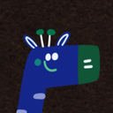

# EvilGiraf



[](https://github.com/pontatot/EvilGiraf/actions)
[](https://sonarqube.pyxis.dopolytech.fr/dashboard?id=EvilGiraf)
[](https://sonarqube.pyxis.dopolytech.fr/dashboard?id=EvilGiraf)
[](https://opensource.org/licenses/MIT)
[](https://dotnet.microsoft.com/download/dotnet/8.0)
[](https://reactjs.org/)
[](https://www.typescriptlang.org/)
[](https://kubernetes.io/)

EvilGiraf is a modern web application platform for deploying, managing and monitoring applications. It provides a robust API and user-friendly interface for application lifecycle management.

## Features

- 🚀 **Application Management**: Create, update, and monitor applications
- 🌐 **API-First**: RESTful API with Swagger documentation
- 🎨 **Modern UI**: Responsive design
- 🚢 **Kubernetes Ready**: Helm charts for easy deployment
- 🔄 **CI/CD**: Automated build and deployment pipelines

## Quick Start

### Prerequisites

- .NET 8.0 SDK
- Node.js 18+ and npm
- Docker
- Kubernetes cluster (for deployment)
- Helm 3.x

### Local Development

1. Clone the repository:

   ```bash
   git clone https://github.com/pontatot/EvilGiraf.git
   cd EvilGiraf
   ```

2. Start the backend:

   ```bash
   cd EvilGiraf
   dotnet restore
   dotnet run
   ```

3. Start the frontend:

   ```bash
   cd EvilGiraf.Front
   npm install
   npm run dev
   ```

4. Access the application:
   - Frontend: `http://localhost:5173`
   - API: `http://localhost:5255`
   - Swagger UI: `http://localhost:5255/swagger`

### Kubernetes Deployment

```bash
helm install evilgiraf ./helm-chart \
  --namespace evilgiraf \
  --create-namespace \
  --set global.environment=production
```

## [Documentation](docs/README.md)

- [Getting Started](docs/getting-started/README.md)
- [API Documentation](docs/api/README.md)
- [Deployment Guide](docs/deployment/README.md)
- [Frontend Guide](docs/frontend/README.md)

## Architecture

EvilGiraf follows a modern microservices architecture:

- **Backend**: .NET Core API with clean architecture
- **Frontend**: React with TypeScript and Tailwind CSS
- **Database**: PostgreSQL with Entity Framework Core
- **Deployment**: Kubernetes with Helm charts
- **CI/CD**: GitHub Actions

## Contributing

We welcome contributions! Please see our [Contributing Guide](docs/CONTRIBUTING.md) for details.

## License

This project is licensed under the MIT License - see the [LICENSE](LICENSE) file for details.

## Support

- 📚 [Documentation](docs/README.md)
- 🐛 [Issue Tracker](https://github.com/pontatot/EvilGiraf/issues)
- 📧 [Contact](mailto:pontatot@gmail.com)
